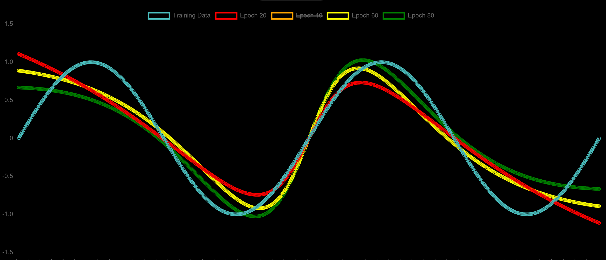

# ModelViz
> *A teaching aid to understand neural network training.*

## Elevator Pitch
*Epochs? Units? Batch Size? Activation?*
 
There are a plethora of parameters that play with when training an neural network. Students have a hard time understanding the effect of each one. That's why I created **ModelViz**. ModelViz makes it simple to visually see the effects that these parameters have. Students can customize a neural network, change the training parameters, and see the neural network learn over time. With ModelViz, students can understand how each value can affect the performance of a neural network.

## Features
1. Selectable Training Data
    - Train a neural network on different mathematical functions
        - `y = sin(x)`
        - `y = x ^ 2`
        - `y = 2 ^ x`
2. Model Creation
    - Create a model with unlimited layers.
    - Choose the neuron count.
    - Select an activation type.
3. Modifiable Training Parameters
    - Epochs
    - Batch Size
    - Domain of Function
    - Point Count
    - Snapshot Count
4. Interactive Visualization
    - View a graph of your model's predictions over time
    - 
5. KNN Viewer
    - For fun, view a scatter plot of a KNN attempting to model a function

### Tech Stach
- Framework: SvelteKit
- Scripts: TypeScript
- Styling: Vanilla CSS
- Deployment: Cloudflare
